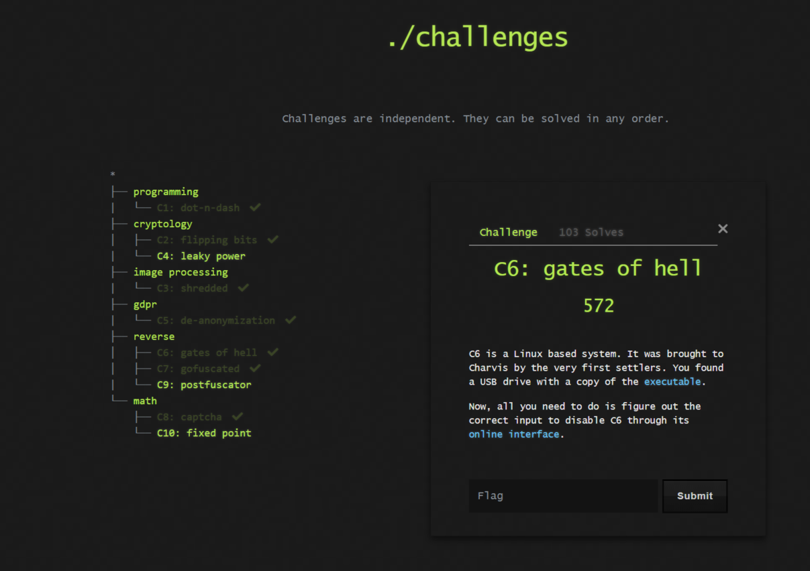
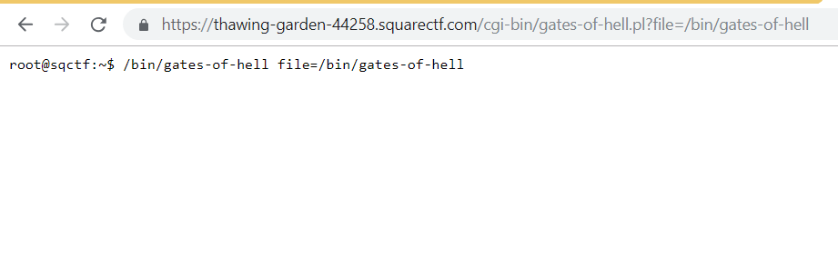
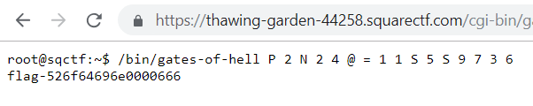

# Gates of hell - [ SquareCTF2018_Reversing ]
---
Joined Square CTF 2018 with TEAM 0x1EA7BEEF

## Description
```
C6: gates of hell

C6 is a Linux based system. It was brought to Charvis by the very first settlers. You found a USB drive with a copy of the executable.

Now, all you need to do is figure out the correct input to disable C6 through its online interface.
```

This is one of the more interesting challenge I have tried so far. Briefly, we can use GDB to deduce and determine the program flow and logic. It sure is troublesome but I have solved it by hand. I will continue to think about an easier way to solve it rather than manually. So, lets get going.

---


## Beginning

First, the type of file was determined to make sure that it is not packed or anything like that.

```bash
$ file gates-of-hell 
gates-of-hell: ELF 32-bit LSB executable, Intel 80386, version 1 (SYSV), statically linked, stripped
```

We can see that the file had been stripped removing valuable information and also it has been statically linked which does not allow one to easily determine what functions had been used here.

Lets try to run the program to look for any  interactions.

```
root@kali:~/Desktop# ./gates-of-hell 
root@kali:~/Desktop# ./gates-of-hell asd
root@kali:~/Desktop# ./gates-of-hell asd asdasdas
root@kali:~/Desktop# ./gates-of-hell asd asdasdas asdasda
root@kali:~/Desktop# ./gates-of-hell asd asdasdas asdasda
root@kali:~/Desktop# ./gates-of-hell asd asdasdas asdasda asd asdasdas asdasda asd asdasdas asdasda asd asdasdas asdasda
```
There did not seem to have much going on outwardly. 

So let's fire up out gdb to see what is happening.

```
gdb-peda$ file gates-of-hell 
Reading symbols from gates-of-hell...(no debugging symbols found)...done.
gdb-peda$ info files
Symbols from "/root/Desktop/gates-of-hell".
Local exec file:
	`/root/Desktop/gates-of-hell', file type elf32-i386.
	Entry point: 0x8048060
	0x08048060 - 0x0804820e is .text
gdb-peda$ break *0x8048060
Breakpoint 1 at 0x8048060
gdb-peda$ run
...
...
...
Breakpoint 1, 0x08048060 in ?? ()
gdb-peda$ x/200i $pc
=> 0x8048060:	pop    eax
   0x8048061:	cmp    eax,0x10
   0x8048064:	jle    0x80480c3
   0x8048066:	add    esp,0x4
   0x8048069:	mov    ecx,0x10
   0x804806e:	mov    ebx,0x25
   0x8048073:	pop    esi
   0x8048074:	push   ecx
   0x8048075:	push   ebx
   0x8048076:	call   0x80481ca
   0x804807b:	pop    ebx
   0x804807c:	push   eax
   0x804807d:	aam    0x12
   0x804807f:	aad    0xf6
   0x8048081:	pop    eax
   0x8048082:	jns    0x8048086
   0x8048084:	xor    ebx,ebx
   0x8048086:	mov    al,BYTE PTR [eax+0x80480ca]
   0x804808c:	xor    edx,edx
   0x804808e:	mul    ebx
   0x8048090:	mov    ebx,eax
   0x8048092:	mov    ecx,0x100
   0x8048097:	mov    al,BYTE PTR [ecx+0x80480c9]
   0x804809d:	dec    al
   0x804809f:	js     0x80480a7
   0x80480a1:	mov    BYTE PTR [ecx+0x80480c9],al
   0x80480a7:	loop   0x8048097
   0x80480a9:	pop    ecx
   0x80480aa:	loop   0x8048073
   0x80480ac:	cmp    ebx,0x29a
   0x80480b2:	jne    0x80480c3
   0x80480b4:	mov    ecx,0x80481f0
   0x80480b9:	mov    edx,0x17
   0x80480be:	call   0x80481e3
   0x80480c3:	mov    eax,0x1
   0x80480c8:	int    0x80
.
.
.
.
.

```
The program ends here at address 0x80480c8 since it is a syscall to exit. note that EAX was given value of one which signifies an exit. There are also no jumps that jumps out of this address so I have made this assumption.

---

## Quick static analysis

There are quite a few commands that are really unfamiliar to me. They are loop, aam and aam. Aside from that, lets scan through the program.

There are two loops being used here as we can see in the opcode, `loop`. After some reading up, loop here uses ECX as counter variable and will be decremented after each iterations.

It seems also that there are some array manipulation going on as well. 
```
   0x8048086:	mov    al,BYTE PTR [eax+0x80480ca]
   ....   
   ....
   ....
   0x8048092:	mov    ecx,0x100
   0x8048097:	mov    al,BYTE PTR [ecx+0x80480c9]
   ...
   ...
   0x80480a1:	mov    BYTE PTR [ecx+0x80480c9],al
   
```

Also it has a relatively large chunk of data stored in the array since there are value 256 in ECX and this ECX is also being used as counter for the loop opcode. This suggests that in this loop, something is done to each element as though there are some sort of adjustments being done.

For this program, we win if and only if we can get the value 666 to be stored in EBX at the end of all the processing.

```
    0x80480ac:	cmp    ebx,0x29a
```

The thing that is controlling ebx in this context is the multiplication of EAX with EBX and later storing the result in EAX.

```
    0x804808e:	mul    ebx
    0x8048090:	mov    ebx,eax
```

There is also a catch; There is a way to mess up the storage of numbers in this register. That is after two operations aam and aad check if the Sign Flag has been set. If it is set then ebx is stored as 0 which is trouble since any number multiplied by 0 is 0. This means EBX will be 0 as long as the sign flag is set even once.

```
0x804807d:	aam    0x12
   0x804807f:	aad    0xf6
   0x8048081:	pop    eax
   0x8048082:	jns    0x8048086        # Jump if not sign else
   0x8048084:	xor    ebx,ebx          # set EBX to 0
..
..
..
..
```

These are the opertions that occurs when these instructions are executed.
We can read more about [aad from here](http://qcd.phys.cmu.edu/QCDcluster/intel/vtune/reference/vc3a.htm) and [aam from here](http://qcd.phys.cmu.edu/QCDcluster/intel/vtune/reference/vc4a.htm).
```
aam 0x12

    AL -->  AL % 18
    AH --> AL / 18

aad 0x0f6

    AL --> (AH *  246) + AL
    AH --> 0
```

Sign flag is being set if AL has 1 in the Most Significant Bit. For example, 0xF3 in resultant AL will result in Sign Flag being set while 0x73 will not. Another note worth noting is that the EAX registers that the operation will occur on is from a function which will be use to multiply to ebx which we need it to be of value 666.

While it is hard to explain all the details here, I have written a pseudocode of the program.
```c
int *temp = argumentList;

// Make sure to have at least 16 arguments though program will terminate at 16
if(argc > 16){
    int x = 16;
    int y = 37;

    do{
        oneInput = temp ;
        temp = &x;

        index = function1(oneInput);     
    
        // A constraint ia found here
        __asm{
            aam 0x12            // eax from function1 is being operated on
            aad 0x0F6           
        }

        z = index ;

        // A line we want to skip at all cost.
        if (SF == 1) y = 0;

        // z is what we want to multiply to y for comparison with value
        z = array_at_80480CA [ index ] ;
        y *= z ;
        i = 256 ;
        do{
        k = array_at_0x80480CA[ i - 1 ] - 1 ; // Same as array_at_0x0x80480C9[ i ]

        /* If current element is not less than 0, decrement and store to
         the current element location else just ignore*/
        if ( k >= 0 ){
            array_at_0x80480CA[ i - 1 ] = k ; // Same as array_at_0x0x80480C9[ i ]
            --i ;
        }
          } while (i) ; 

        x = temp - 1;   // on to the next argument
    } while (  temp != 1 ); // while 16 arguments are not being iterated through
    if( y == 666 ){
    printf("flag is here on server"); 
    }
    exit();
}
```

Lets take a look at function1 ( located at 0x80481ca ),

```
   0x8048073:	pop    esi
   0x8048074:	push   ecx
   0x8048075:	push   ebx      # Stores EBX result on stack since it will
                                # be used in the function 0x80481ca
   0x8048076:	call   0x80481ca
```

Examining function1,
```
gdb-peda$ x/200i $pc
   0x80481ce:	mov    dl,BYTE PTR [esi]
   0x80481d0:	inc    esi
   0x80481d1:	sub    dl,0x30
   0x80481d4:	cmp    dl,0x39
   0x80481d7:	ja     0x80481e2
   0x80481d9:	mul    bl
   0x80481db:	add    al,dl
   0x80481dd:	call   0x80481ce   # Calls itself again
   0x80481e2:	ret    
   0x80481e3:	mov    eax,0x4
   0x80481e8:	mov    ebx,0x1
   0x80481ed:	int    0x80
   0x80481ef:	ret 
```

There is another constraint being found here. ESI register here contain the argument that you have added. This function will be called 16 times thanks to the loop command with parameter as the input argument.

The ASCII value of the argument is then subtracted by 48 and then compared to see if the result is less than 57. If the number is less than 57 then recursion occurs by calling itself by  At first it looks impossible however these are a byte which means they have just 8 bits and it is possible to overflow the 8 bit space. For example: 0x29 - 0x30 = 0xF9 which gives a number greater than 57 and thus breaks out of the recursion.

Pseudocode looks something like this

```c

char function1( char *argumentX){

    char d = *argumentX;   
    char a = 0; 
    argumentX++;        // Goes down the string in the argument
    char compare = d - 48;
    if(compare <= 57){
        result = function1(argumentX);   // Go to the next character
    }
    return result;      // This is the index will be pointed to the array chunk
}
```
For my case, I used all single characters as argument followed by a space. This is so that there will be value 0x00 after every argument which allows for the overflow.

---
## Solution

Firstly, there are too many ASCII to try out one by one therefore with the constraints found, we can try to reduce the possibilities and narrow to a smaller group of possible arguments.

We can deal with the aam and aad instructions.

aam refers to Adjust AX after Multiplication and aad refers to Adjust AX After Division. 

```
aam 0x12
    AL -->  AL % 18
    AH --> AL / 18

aad 0x0f6

    AL --> (AH *  246) + AL
    AH --> 0
```

Since aam occurs before aad, we can formulate a constraint equation and try it for ASCII value from 0 to 255 such that the resultant AL value is smaller than 0x7F and larger than 0.

```
aam 18

    X         Y             INITIAL
_____________________
|_________|_________|
   Y/18       Y%18          RESULT


aad 246
    A          B        INITIAL
_____________________
|_________|_________|

    0000   A*246 + B       RESULT


Since we know A = Y/18 and B = Y%18, we can substitute into the result after aad 246.

we get:
    AL = Y/18*246 + Y%18
       = Y%18 - 10/18*Y         # Because it is a signed number and 247 is actually -10   

Remember that we do not want this value to be signed. This means AL < 127 and AL > 0.
```

For this purpose of checking what are the possible values to be used, we can write a short python script.

```python
for i in range(0,255):
    x = i%18-i/18*10
    if x < 0x7f and x > 0:
   	 # The reason we add 0x30 is because i will be subtracted by 0x30 so we need to add it back for the POSSIBLE CHARACTER
   	 print("ASCII : "+str(i+0x30)+" from "+str(i)+", Possible Character : " + chr(i+0x30))
```

This prints the ASCII arguments that can be used and will not violate the constraint of a signed AL. The result is as folllows

```
ASCII : 49 from 1, Possible Character : 1
ASCII : 50 from 2, Possible Character : 2
ASCII : 51 from 3, Possible Character : 3
ASCII : 52 from 4, Possible Character : 4
ASCII : 53 from 5, Possible Character : 5
ASCII : 54 from 6, Possible Character : 6
ASCII : 55 from 7, Possible Character : 7
ASCII : 56 from 8, Possible Character : 8
ASCII : 57 from 9, Possible Character : 9
ASCII : 58 from 10, Possible Character : :
ASCII : 59 from 11, Possible Character : ;  # TO BE DELETED
ASCII : 60 from 12, Possible Character : <  # TO BE DELETED
ASCII : 61 from 13, Possible Character : =
ASCII : 62 from 14, Possible Character : >  # TO BE DELETED
ASCII : 63 from 15, Possible Character : ?
ASCII : 64 from 16, Possible Character : @
ASCII : 65 from 17, Possible Character : A
ASCII : 77 from 29, Possible Character : M
ASCII : 78 from 30, Possible Character : N
ASCII : 79 from 31, Possible Character : O
ASCII : 80 from 32, Possible Character : P
ASCII : 81 from 33, Possible Character : Q
ASCII : 82 from 34, Possible Character : R
ASCII : 83 from 35, Possible Character : S
```

The comment TO BE DELETED is because if it is a special character in the bash command for us to test it out.

#### The long array

There is a loop section for 256 times.

```c
..
..
..
        do{
        k = array_at_0x80480CA[ i - 1 ] - 1 ; // Same as array_at_0x0x80480C9[ i ]

        /* If current element is not less than 0, decrement and store to
         the current element location else just ignore*/
        if ( k >= 0 ){
            array_at_0x80480CA[ i - 1 ] = k ; // Same as array_at_0x0x80480C9[ i ]
            --i ;
        }
          } while (i) ; 
..
..
..
```
What this effectively does  is that in the first iteration, it will traverse starting from the end of the array down to the first and decrement the element's value if the element is not already 0x00, then in the next iteration, traverse from the last second element to the first and decrement value if not already 0x00 and so on till it reaches the first element in the array.


```
Example : LOOP FOR 4 TIMES

Initial

0x5 0x3 0x3 0x2

First Iteration
    0x4 0x2 0x2 0x1

Second iteration
    0x3 0x1 0x1 0x1

Third Iteration
    0x2 0x0 0x1 0x1

Last iteration
    0x1 0x0 0x1 0x1
```
This means for every iteration, changes to element are made and so we have to account for that. 

To view the whole array, we know that the array of interest is in `0x80480CA`.

```
gdb-peda$ x/256bx 0x80480ca
0x80480ca:	0x05	0x09	0x04	0x0f	0x05	0x0b	0x10	0x0e
0x80480d2:	0x0b	0x0d	0x0d	0x08	0x0c	0x07	0x10	0x02
0x80480da:	0x06	0x04	0x0b	0x04	0x02	0x0d	0x07	0x0a
0x80480e2:	0x04	0x0c	0x0e	0x10	0x07	0x06	0x03	0x0e
0x80480ea:	0x01	0x09	0x01	0x0c	0x0e	0x0a	0x0b	0x05
0x80480f2:	0x01	0x09	0x08	0x0d	0x06	0x02	0x10	0x06
0x80480fa:	0x06	0x02	0x03	0x06	0x0b	0x0e	0x05	0x05
0x8048102:	0x03	0x0f	0x01	0x05	0x07	0x0d	0x08	0x05
0x804810a:	0x0c	0x10	0x01	0x02	0x08	0x04	0x0c	0x05
0x8048112:	0x0b	0x0d	0x0d	0x08	0x09	0x03	0x09	0x0a
0x804811a:	0x0c	0x10	0x0b	0x06	0x06	0x0d	0x02	0x0e
0x8048122:	0x0d	0x0e	0x03	0x04	0x01	0x06	0x0c	0x0e
0x804812a:	0x05	0x09	0x01	0x04	0x08	0x04	0x07	0x06
0x8048132:	0x0c	0x05	0x05	0x03	0x03	0x0d	0x0b	0x0c
0x804813a:	0x05	0x01	0x04	0x02	0x03	0x0f	0x0b	0x10
0x8048142:	0x01	0x02	0x02	0x04	0x0c	0x05	0x0a	0x06
0x804814a:	0x0e	0x02	0x05	0x0f	0x0d	0x0d	0x0a	0x0f
0x8048152:	0x07	0x08	0x0e	0x06	0x0a	0x0b	0x05	0x0a
0x804815a:	0x01	0x0c	0x0a	0x0a	0x07	0x07	0x10	0x08
0x8048162:	0x09	0x08	0x0b	0x0c	0x0a	0x10	0x0f	0x09
0x804816a:	0x10	0x10	0x0c	0x02	0x07	0x01	0x0f	0x06
0x8048172:	0x04	0x03	0x08	0x0b	0x0d	0x07	0x03	0x05
0x804817a:	0x10	0x04	0x0b	0x09	0x0c	0x02	0x0d	0x01
0x8048182:	0x0c	0x05	0x0b	0x0b	0x09	0x0f	0x04	0x10
0x804818a:	0x08	0x0b	0x07	0x07	0x07	0x08	0x0c	0x02
0x8048192:	0x07	0x04	0x06	0x04	0x0f	0x05	0x01	0x04
0x804819a:	0x07	0x04	0x04	0x03	0x0a	0x07	0x0c	0x0f
0x80481a2:	0x07	0x0c	0x01	0x0e	0x04	0x04	0x0b	0x01
0x80481aa:	0x0f	0x0e	0x09	0x0e	0x10	0x02	0x04	0x0c
0x80481b2:	0x02	0x0f	0x0f	0x03	0x04	0x09	0x08	0x0f
0x80481ba:	0x10	0x03	0x0e	0x0d	0x04	0x03	0x02	0x01
0x80481c2:	0x09	0x0c	0x01	0x07	0x02	0x0a	0x08	0x0a
```

I was thinking for a really long time also because this is where value is being picked to be mulitplied to EBX to get 666. So I broke it down to 666 = 3 x 3 x 2 x 37 but 37 is a prime number and we cant find it anywhere here. After thinking and looking around, i realised 37 was already given from the start.

```
   0x804806e:	mov    ebx,0x25   #37
```
This was perfect. So the problem now is to get the index which will be chosen by function1 since function1 chooses the index of what value to multiply to EBX and our input determines which index get chosen.

#### BRIEF PROGRAM FLOW

```
for each of the 16 arguments:
    function1 chooses index based on argument
    if index is signed
        break
    EBX will be multiplied by array[index]
    alter array

Check if EBX = 666
``` 
This shows that our input argument is mapped to certain numbers which we will eventually want to map it to
```
37    *1*3*1*1*1*1*1*2*1*3*1*1*1*1*1*1

It is in such strange order because there are some index that are out of possible range as the array alter at the time of solving it.
```

The problem for checking sign is dealt with as long as we choose a possible value.
We have to keep track of the changes in the array such that as we traverse down the arguments we input, we have to remember the state of the array.

For this challenge, I had done it manually by comparing the values that I want with the initial array state.

### FIRST VALUE
For the FIRST value to  multiply 37 is 1.
So we first want to find the index where it is located in the array. 
```
0x80480ca:	0x05	0x09	0x04	0x0f	0x05	0x0b	0x10	0x0e
0x80480d2:	0x0b	0x0d	0x0d	0x08	0x0c	0x07	0x10	0x02
0x80480da:	0x06	0x04	0x0b	0x04	0x02	0x0d	0x07	0x0a
0x80480e2:	0x04	0x0c	0x0e	0x10	0x07	0x06	0x03	0x0e
0x80480ea:	0x01
```

Here the index is 0x80480ea - 0x80480ca = 32.
Remember that in function1, we subtract 48 or 0x30. This means we need to add it to get ASCII value to get 80 to get character 'P'.
Now we check if it is a subset of the possible range and yes it is!

```
.
.
ASCII : 79 from 31, Possible Character : O
ASCII : 80 from 32, Possible Character : P
ASCII : 81 from 33, Possible Character : Q
.
.
```
 Also the current state of the array is intial, we do not add anything.

Checking with GDB
```
gdb-peda$ set args P A A A A A A A A A A A A A A A A A A AA A A A 

.
.
.
[----------------------------------registers-----------------------------------]
EAX: 0x1                        <----------------------- HERE IS THE TARGET VALUE
EBX: 0x25 ('%')
ECX: 0x10 
EDX: 0xd0 
ESI: 0xffffd594 --> 0x410041 ('A')
EDI: 0x0 
EBP: 0x0 
ESP: 0xffffd398 --> 0x10 
EIP: 0x804808c --> 0xe3f7d231
EFLAGS: 0x213 (CARRY parity ADJUST zero sign trap INTERRUPT direction overflow)
[-------------------------------------code-------------------------------------]
   0x8048082:	jns    0x8048086
   0x8048084:	xor    ebx,ebx
   0x8048086:	mov    al,BYTE PTR [eax+0x80480ca]
=> 0x804808c:	xor    edx,edx
   0x804808e:	mul    ebx

.
.
.

```

Here we get EAX = 0x1 as what we want which we will then multiply with EBX and later stored in EBX; i.e. 37*1

We can justify that by stepping a few lines

```
[----------------------------------registers-----------------------------------]
EAX: 0x25 ('%')
EBX: 0x25 ('%')                <----------------- HERE IS THE RESULT OF 37*1
ECX: 0x10 
EDX: 0x0 
ESI: 0xffffd594 --> 0x410041 ('A')
EDI: 0x0 
EBP: 0x0 
ESP: 0xffffd398 --> 0x10 
EIP: 0x8048092 --> 0x100b9
EFLAGS: 0x202 (carry parity adjust zero sign trap INTERRUPT direction overflow)
[-------------------------------------code-------------------------------------]
   0x804808c:	xor    edx,edx
   0x804808e:	mul    ebx
   0x8048090:	mov    ebx,eax
=> 0x8048092:	mov    ecx,0x100
   0x8048097:	mov    al,BYTE PTR [ecx+0x80480c9]

```

### SECOND VALUE
Second value from `37    *1*3*1*1*1*1*1*2*1*3*1*1*1*1*1*1 ` is 3.

Looking up the intial table we get 

```
0x80480ca:	0x05	0x09	0x04	0x0f	0x05	0x0b	0x10	0x0e
0x80480d2:	0x0b	0x0d	0x0d	0x08	0x0c	0x07	0x10	0x02
0x80480da:	0x06	0x04	0x0b	0x04	0x02	0x0d	0x07	0x0a
0x80480e2:	0x04	0x0c	0x0e	0x10	0x07	0x06	0x03
```
Here our values in the table will be decremented by 1. Since we are only interested in elements really close to the start and only for 16 iterations, we wont be affected by the elements near the end not changing.

We need to remember to mentally add the value 1 since it is in the next position of the input arguments. Since we are interested in value 3 (to be multiplied to EBX), we add 3 to 1 = 4 and start searching for 0x4 in the table which we can see in the index 2. 

Adding 48 to 2 to give 50 which is also part of the possible character 2.
```
ASCII : 49 from 1, Possible Character : 1
ASCII : 50 from 2, Possible Character : 2
ASCII : 51 from 3, Possible Character : 3
.
.
```
Thus our second argument is 2

Testing it out on GDB

```
gdb-peda$ b *0x804808c
gdb-peda$ set args P 2 A A A A  A A A A A A A A A A  AA 

.
.
.

EAX: 0x3                           <------------- THE 0x3 WE WANTED
EBX: 0x25 ('%')
ECX: 0xf 
EDX: 0xd0 
ESI: 0xffffd59b --> 0x410041 ('A')
EDI: 0x0 
EBP: 0x0 
ESP: 0xffffd3ac --> 0xf 
EIP: 0x804808c --> 0xe3f7d231
EFLAGS: 0x202 (carry parity adjust zero sign trap INTERRUPT direction overflow)
[-------------------------------------code-------------------------------------]
   0x8048082:	jns    0x8048086
   0x8048084:	xor    ebx,ebx
   0x8048086:	mov    al,BYTE PTR [eax+0x80480ca]
=> 0x804808c:	xor    edx,edx
   0x804808e:	mul    ebx

gdb-peda$ ni
..
gdb-peda$ ni
..
gdb-peda$ ni
..
gdb-peda$ ni

[----------------------------------registers-----------------------------------]
EAX: 0x6f ('o')
EBX: 0x6f ('o')         <------------0x6f = 111 which is 37*3 which is  correct
ECX: 0xf 
EDX: 0x0 
ESI: 0xffffd59b --> 0x410041 ('A')
EDI: 0x0 
EBP: 0x0 
ESP: 0xffffd3ac --> 0xf 
EIP: 0x8048092 --> 0x100b9
EFLAGS: 0x206 (carry PARITY adjust zero sign trap INTERRUPT direction overflow)
[-------------------------------------code-------------------------------------]
   0x804808c:	xor    edx,edx
   0x804808e:	mul    ebx
   0x8048090:	mov    ebx,eax
=> 0x8048092:	mov    ecx,0x100
...
```

As we carry on ...

```
    37     Iteration  Find          Index    ASCII_Value   Character
    -----------------------------------------------------------------------
    *1          0      1+0=1         32        48+32=80        P
    
    *3          1      3+1=4          2        48+2=50         2

    *1          2      1+2=3          30       48+30=78        N

    *1          3      3+1=4          2        48+2=50         2

    *1          4      1+4=5          4        48+4=52         4

    *1          5      1+5=6          16       48+16=64        @

    *1          6      1+6=7          13       48+13=61        =

    *2          7      2+7=9          1        48+1=49         1

    *1          8      1+8=9          1        48+1=19         1

    *3          9      3+9=0xc        35       48+35=83        S

    *1          10     1+10=0xb       5        48+5=53         5
    
    *1          11     1+11=0xc       35       48+35=83        S

    *1          12     1+12=0xd       9        48+9=57         9

    *1          13     1+13=0xe       7        48+7=55         7
    
    *1          14     1+14=0xf       3        48+3=51         3

    *1          15     1+15=0x10      6        48+6=54         6
```

We can now test the program with the found characters
P 2 N 2 4 @ = 1 1 S 5 S 9 7 3 6

```
root@kali:~/Desktop# ./gates-of-hell  P 2 N 2 4 @ = 1 1 S 5 S 9 7 3 6
flag is here on server
```
PERFECT!!

Now we can go on to submit through the "online interface". There is no where for us to submit the flag though it look like a terminal.


The strange thing in the URL is that it seems to be a perl file. It is almost as though we can run a program with the URL. So I tried ?file=/bin/gates-of-hell.



We can see that it seems to append behind then only did i realise that the command line is waiting for input. Since the string `P 2 N 2 4 @ = 1 1 S 5 S 9 7 3 6` has to be used as part of URL, we have to encode it. 

After encoding, we get 
```
P%202%20N%202%204%20%40%20%3D%201%201%20S%205%20S%209%207%203%206
```
Now all we need to do is to prepend a question mark and append the whole string behind the url.

```
https://thawing-garden-44258.squarectf.com/cgi-bin/gates-of-hell.pl?P%202%20N%202%204%20%40%20%3D%201%201%20S%205%20S%209%207%203%206
```



And VOILA!  THE FLAG IS PRESENTED TO US!!!!!!!!!!!!!!!!!!

```Flag: flag-526f64696e0000666```
---

---