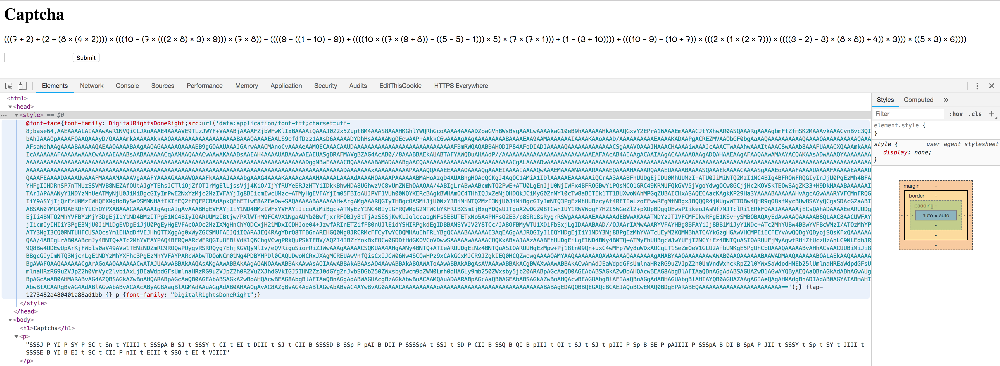

# C8: Captcha

- Category: Math
- URL: <https://squarectf.com/2018/captcha.html>

## Description

Charvises (the native species which lived on Charvis 8HD before the first settlers arrived) were very good at math. In a surprising symbiosis relationship between humans and Charvises, it was agreed that the Charvises would be responsible for C8.

Can you pass their CAPTCHA (Completely Automated Public Turing Test to tell Charvises and Humans Apart)?

## The challenge

At first sight, the challenge looks deceptively simple: solve a long math equation that only involves `+`, `-`, `*` and parentheses. However, trying to copy-paste the equation into Google (our trusty calculator) reveals that the individual "characters" are actually mapped to a different set of characters entirely. This is because of a custom font, that is embedded in the HTML:



So let's try solving it by hand, transcribing the entire equation by hand... But alas! There is a pretty short time limit if we do that.

Refreshing the page results in an entirely new equation, with a new font as well...

## OCR

The first thing we tried was to look into OCR. However, taking a screenshot of the page, uploading it onto one of the many OCR websites online, followed by evaluating the equation in Python, still took us at best 30 seconds.

We tried to script an exploit to automatically take a screenshot from the page, upload the image to a OCR service, and evaluate the result, but we found it quite troublesome and decided on another approach.

## TrueType

So basically the next line of thinking is as follows: Since we know that the substitution of characters is by using a custom font, and the font is a mapping of a single character (e.g. `c`) to what it actually visually represents (e.g. `(`), we can simply try to extract the information in the TTF to find that mapping, and reverse the mapping to find the original text that is encoded with the font.

We first fetch the font, and save it locally:

```python
# Fetch HTML from the page and get the base64-encoded TTF
res = requests.get(URL)
ttf = re.findall(r"base64,([a-zA-Z0-9\/+=]*)", res.text)[0]
ttf = base64.decodestring(ttf)

# Save TTF to file
with open('font.ttf', 'w') as f:
    f.write(ttf)
```

## FontTools

Next, we found a great Python package/tool that allows us to dump a TTF into a TTX file, which is a XML file that stores the TrueType information for the font, something like this:

```xml
<?xml version="1.0" encoding="UTF-8"?>
<ttFont sfntVersion="\x00\x01\x00\x00" ttLibVersion="3.32">

  <GlyphOrder>
    <!-- The 'id' attribute is only for humans; it is ignored when parsed. -->
    <GlyphID id="0" name="glyph00000"/>
    <GlyphID id="1" name="glyph00001"/>
    <GlyphID id="2" name="glyph00002"/>
    <GlyphID id="3" name="glyph00003"/>

    ...
```

This can be done using [FontTools](https://github.com/fonttools/fonttools), either through the command line with `ttx font.ttf` or programmatically:

```python
from xml.etree import ElementTree
from fontTools import ttx

ttx.ttDump('font.ttf', 'font.ttx', ttx.Options([], 1))
tree = ElementTree.parse('font.ttx').getroot()
```

## Identifying the Glyphs

Skimming through the TTX, we find a useful section:

```xml
<cmap_format_4 platformID="0" platEncID="3" language="0">
  <map code="0x44" name="glyph00010"/><!-- LATIN CAPITAL LETTER D -->
  <map code="0x45" name="glyph00012"/><!-- LATIN CAPITAL LETTER E -->
  <map code="0x47" name="glyph00009"/><!-- LATIN CAPITAL LETTER G -->
  <map code="0x48" name="glyph00002"/><!-- LATIN CAPITAL LETTER H -->
  <map code="0x49" name="glyph00004"/><!-- LATIN CAPITAL LETTER I -->
  <map code="0x4a" name="glyph00015"/><!-- LATIN CAPITAL LETTER J -->
  <map code="0x52" name="glyph00007"/><!-- LATIN CAPITAL LETTER R -->
  <map code="0x54" name="glyph00005"/><!-- LATIN CAPITAL LETTER T -->
  <map code="0x58" name="glyph00011"/><!-- LATIN CAPITAL LETTER X -->
  <map code="0x5a" name="glyph00008"/><!-- LATIN CAPITAL LETTER Z -->
  <map code="0x68" name="glyph00013"/><!-- LATIN SMALL LETTER H -->
  <map code="0x6c" name="glyph00014"/><!-- LATIN SMALL LETTER L -->
  <map code="0x6f" name="glyph00006"/><!-- LATIN SMALL LETTER O -->
  <map code="0x70" name="glyph00001"/><!-- LATIN SMALL LETTER P -->
  <map code="0x77" name="glyph00003"/><!-- LATIN SMALL LETTER W -->
</cmap_format_4>
```

This particular `cmap_format_4` tag specifies the mapping of ASCII codes to glyphs by name.

Additionally, we find that the actual vector information for the glyphs are defined as such:

```xml
<TTGlyph name="glyph00001" xMin="0" yMin="-128" xMax="290" yMax="747">
  <contour>
    <pt x="239" y="-127" on="1"/>
    <pt x="234" y="-126" on="0"/>
    <pt x="228" y="-120" on="1"/>
    <pt x="143" y="-48" on="0"/>
    <pt x="50" y="176" on="0"/>
    <pt x="50" y="304" on="1"/>
    <pt x="50" y="393" on="0"/>
    <pt x="93" y="566" on="0"/>
    <pt x="177" y="704" on="0"/>
    <pt x="235" y="740" on="1"/>
    <pt x="245" y="747" on="0"/>
    <pt x="269" y="747" on="0"/>
    <pt x="290" y="730" on="0"/>
    <pt x="290" y="716" on="1"/>
    <pt x="290" y="705" on="0"/>
    <pt x="279" y="692" on="0"/>
    <pt x="271" y="686" on="1"/>
    <pt x="256" y="674" on="1"/>
    <pt x="186" y="619" on="0"/>
    <pt x="118" y="420" on="0"/>
    <pt x="118" y="304" on="1"/>
    <pt x="118" y="206" on="0"/>
    <pt x="164" y="64" on="0"/>
    <pt x="225" y="-20" on="0"/>
    <pt x="266" y="-62" on="1"/>
    <pt x="285" y="-83" on="0"/>
    <pt x="285" y="-98" on="1"/>
    <pt x="285" y="-110" on="0"/>
    <pt x="265" y="-128" on="0"/>
    <pt x="244" y="-128" on="0"/>
  </contour>
  <instructions/>
</TTGlyph>
```

Without going into the details of the actual vector glyph system for TrueType, we realise that since the glyphs are always the same for the set of 10 digits, 3 operators and 2 parentheses symbols, we can first extract out the actual `TTGlyph` vector information and find out the actual symbol it is drawing, by manually mapping the symbol to encoded letter and then to the `TTGlyph` data by visual inspection.

Based on the TTX file, it looks like the `TTGlyph` tag's attributes are always unique, with the exception of the two parenthesis symbols `(` and `)`, which we can differentiate them by the first `pt` tag. For example:

```xml
<!-- This maps to a 6, just based on xMin/Max and yMin/Max values alone. -->
<TTGlyph name="glyph00002" xMin="0" yMin="0" xMax="544" yMax="679">
  ...
</TTGlyph>

<!-- This maps to a (, based on the first point's values. -->
<TTGlyph name="glyph00001" xMin="0" yMin="-128" xMax="290" yMax="747">
  <pt x="239" y="-127" on="1"/>
  ...
</TTGlyph>
```

We can get the mapping as such:

```python
ttglyph_mapping = {
    # Mapping of symbol to x/y Min/Max values
    "0": {
        "xMin": 0,
        "yMin": 0,
        "xMax": 585,
        "yMax": 660,
    },
    "1": {
        "xMin": 0,
        "yMin": 0,
        "xMax": 311,
        "yMax": 673,
    },
    "2": {
        "xMin": 0,
        "yMin": 0,
        "xMax": 497,
        "yMax": 704,
    },
    "3": {
        "xMin": 0,
        "yMin": 0,
        "xMax": 548,
        "yMax": 684,
    },
    "4": {
        "xMin": 0,
        "yMin": -3,
        "xMax": 576,
        "yMax": 690,
    },
    "5": {
        "xMin": 0,
        "yMin": 0,
        "xMax": 531,
        "yMax": 690,
    },
    "6": {
        "xMin": 0,
        "yMin": 0,
        "xMax": 544,
        "yMax": 679,
    },
    "7": {
        "xMin": 0,
        "yMin": 0,
        "xMax": 510,
        "yMax": 696,
    },
    "8": {
        "xMin": 0,
        "yMin": 0,
        "xMax": 569,
        "yMax": 689,
    },
    "9": {
        "xMin": 0,
        "yMin": 0,
        "xMax": 561,
        "yMax": 689,
    },
    "+": {
        "xMin": 0,
        "yMin": 0,
        "xMax": 495,
        "yMax": 519,
    },
    "-": {
        "xMin": 0,
        "yMin": 0,
        "xMax": 465,
        "yMax": 347,
    },
    "*": {
        "xMin": 0,
        "yMin": 0,
        "xMax": 444,
        "yMax": 481,
    },

    # Parentheses use the first child of <pt>, because their attributes are identical
    "(": {
        "x": 239,
        "y": -127,
        "on": 1,
    },
    ")": {
        "x": 61,
        "y": -119,
        "on": 1,
    },
}
```

## Putting it all together

With that, writing the complete script is just a matter of hard work and writing correct code under time pressure. We can write everything in a single script, which performs the following:

1. `GET` the page, and extract the TTF data and encoded equation string
2. Dump the TTX information and find the mapping of glyphs to ASCII code (encoded letters)
3. Map the encoded letters back to the actual equation symbols from the glyphs it maps to
4. `eval` the equation and find the answer
5. `POST` the answer back to get the flag

## Complete exploit

See [`exploit.py`](./exploit.py) for the complete Python script.

## Flag

```sh
$ python ttf.irvin.py
[*] Equation: (((((1 * 10) + (5 * 4)) + (((((6 - 9) + (((2 * 1) * 6) * (6 + 8))) + 7) * ((6 - 8) + 5)) + (9 + (7 - 8)))) + (6 + 7)) - (((6 * (8 * 8)) - 4) * ((((3 * 6) + 3) + 3) - ((3 * 6) - ((((2 * (8 * 8)) * ((5 * 2) - (7 * 7))) * ((4 * 9) * 5)) * ((7 + (3 - ((3 * 6) - ((7 + 5) - 8)))) * (1 * (4 * 8))))))))
[*] Evaluated answer: -43705960113
[*] Submitting answer...
[*] Response text:

If you can see this then you have solved the CAPTCHA.
If you have solved the CAPTCHA then you are a Charvise.
If you are a Charvise then you are welcome on Charvis.
If you are welcome on Charvis then:
You can disable this system using flag-a76013167fd4c04e3134
You should be given useful information.
If you should be given useful information then this informs you that there are two layers of defense left, and the last one is trivial.

[*] Flag: flag-a76013167fd4c04e3134
```
