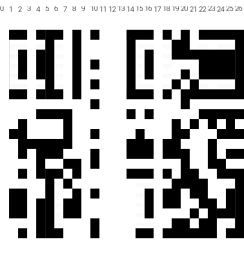
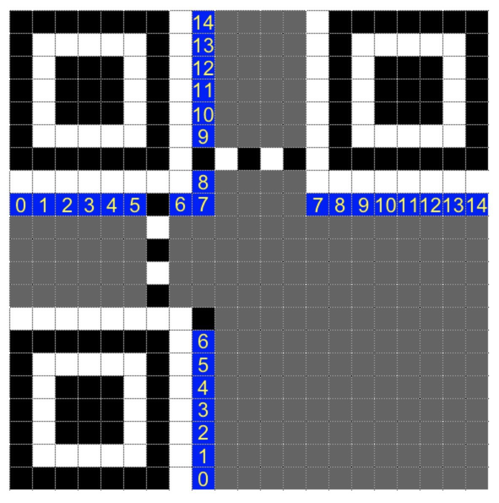
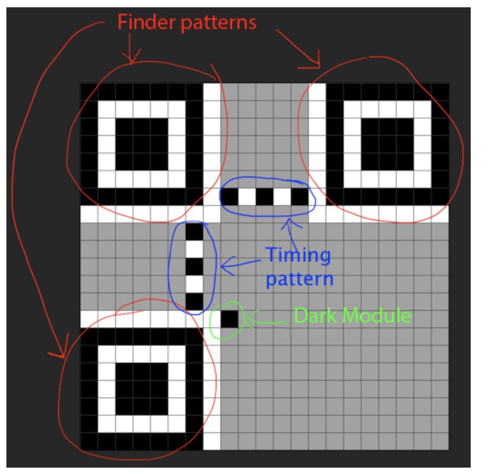
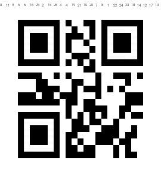

# C3: Shredded

- Category: Image processing

## Description

Instructions to disable C3 were mistaken for an advertisement for new housing on Charvis 9HD. They’ve been shredded in the final office tidy-up. Nobody bothered to empty the trash, so a bit of glue and you should be good?

note: flag is in uppercase for this puzzle.

## The challenge

We are given 27 images, each one of equal size and containing just black and white colours. Moreover, from the challenge description we are supposed to piece back the individual "strips" into the original image.

## Pillow

For this challenge, we used [`Pillow`](https://pillow.readthedocs.io/en/5.3.x/) as our image processing library of choice to paste the pieces back together.

As an initial test, we simply pieced back the images in the order of their filename:

```python
import os

from PIL import Image

images = [Image.open(os.path.join('shredded', '%s.png' % i)) for i in xrange(0, 27)]
widths, heights = zip(*(i.size for i in images))

total_width = sum(widths)
max_height = max(heights)

new_im = Image.new('RGB', (total_width, max_height))

x_offset = 0
for im in images:
    new_im.paste(im, (x_offset, 0))
    x_offset += im.size[0]

new_im.show()
```

This gives us the following image:


It becomes apparent that this is a QR code that we need to piece back together.

## Brute force search

Initially, we tried to brute force search all possible permutations of the strips to arrange them back together. Using Pillow and [pyzbar](https://pypi.org/project/pyzbar/), we can attempt to decode the resultant image as a QR code, and if it returns a result, it means that we have found the correct permutation. Since QR has error correction capabilities (maybe not for v1), it could be possible to stumble upon the answer quickly.

The code would thus look something like this:

```python
from itertools import permutations

from PIL import Image
from pyzbar.pyzbar import decode

for perm in permutations(range(27)):
    new_im = Image.new('RGB', (total_width, max_height))
    for im in images:
        new_im.paste(im, (x_offset, 0))
        x_offset += im.size[0]

    data = decode(new_im)
    if data:
        print(data)
        new_im.show()
        break
```

However after some quick math we realised it would take forever since there are 27! = 1.08888695e28 permutations.

## QR specification

From inspecting the strips more, we realise that each strip's width is exactly the width of a single block/pixel in the QR code. Additionally, there are 6 strips which are completely white. This means that the QR code we are dealing with is 21x21, which corresponds to QR version 1.

We can generate an image that helps us identify the strips better:



The following is image shows the standard modules for a v1 QR code:



There are several properties that would allow us to fix the locations for certain strips:



- 3x finder patterns: Two of them should be vertically aligned; this means that we can separate the left 7 strips from the right 7 strips
- Vertical timing pattern: This allows us to identify column 0 from column 6 (the black border of the finder pattern), which are 5 and 26 respectively
- White padding: There are two strips (3 and 7) that are not completely white, but give correspond to columns 7 and 13. Since column 7 needs white modules at the bottom as well, can identify that 3 is for column 7 and 7 is for column 13.
- Horizontal timing pattern: The remaining 5 strips belong to the middle columns, and we can use the modules at row 6 to separate columns 8, 10, 12 from 9 and 11.

This narrows our search space down to the follow set of permutations (indices shown are the column number):

```python
permutes = [
    [4, 8],
    [5, 6, 7],
    [10, 16],
    [11, 13, 15],
    [12, 14],
    [17, 23],
    [18, 22],
    [19, 20, 21],
]
```

This search space of 6912 items can be solved in a reasonable amount of time.

## Complete exploit

The rest of the exploit is just to generate the permutations and apply the technique we tried earlier to find the flag.

## Flag

```sh
$ python exploit.py
GOOD JOB. FLAG-80AD8BCF79
```


